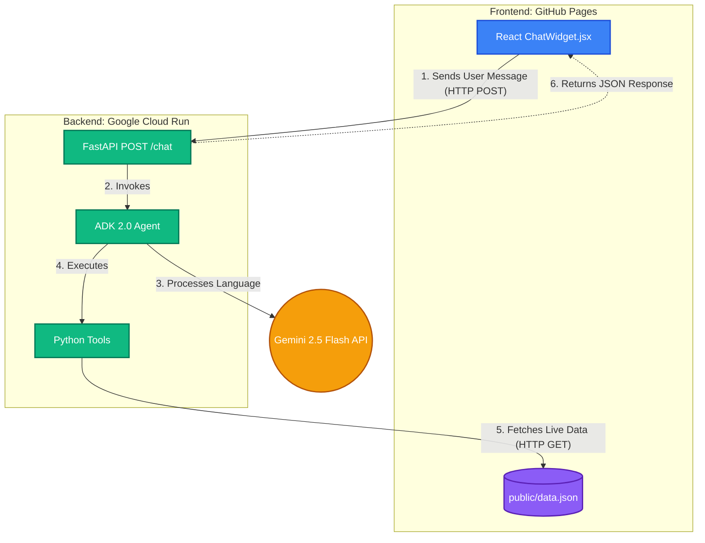
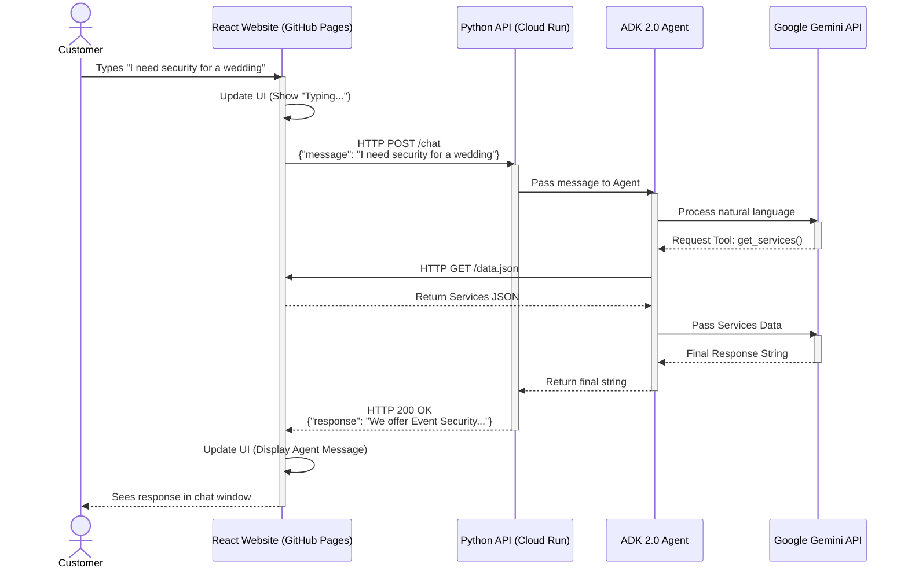

# Al-Marsoos AI Agent Architecture

This document outlines the high-level architecture and interaction flow for integrating the ADK 2.0 AI Agent into the Al-Marsoos Security static React website.

## 1. System Components

The architecture is strictly divided into two decoupled systems (The "Face" and the "Brain"):

### A. The Frontend (The "Face")
*   **Hosting:** GitHub Pages
*   **Tech Stack:** React (Vite), JavaScript, TailwindCSS
*   **Role:** Renders the ChatWidget.jsx. It handles the local UI state (displaying "Typing..." animations and chat bubbles). It captures the user's input but contains **zero** AI logic.
*   **Data Source:** The frontend fetches text content (Services, Leadership, etc.) from a local public/data.json file.

### B. The Backend (The "Brain")
*   **Hosting:** Google Cloud Run (https://al-marsoos-agent-188364900679.us-central1.run.app)
*   **Tech Stack:** Python, FastAPI, Google ADK 2.0, Gemini 2.5 Flash
*   **Role:** Exposes a secure @app.post("/chat") REST API endpoint. It manages the conversation history, processes natural language, executes custom tools, and formats the final response.
*   **Data Source:** The Python agent uses HTTP requests to read the exact same data.json file hosted on GitHub Pages, ensuring a **Single Source of Truth** for all company knowledge.

---

## 2. Structural Diagram (Component Architecture)

This diagram shows the physical components of your architecture and how they connect to each other.



---

## 3. Interaction Flow (Sequence Diagram)

When a customer visits the website and types a message, the following sequence occurs seamlessly over the internet:



---

## 4. ADK Agent Specific Behaviors

Based on our architectural review, the Python ADK 2.0 Agent will be configured with the following specific capabilities:

1.  **Strict Domain Guardrails:** The agent's System Prompt will explicitly forbid it from answering questions unrelated to Al-Marsoos or the security industry, ensuring it remains a professional corporate assistant.
2.  **Deterministic Business Logic:** A custom Python Tool (`calculate_event_security`) will be provided to the agent to mathematically calculate guard requirements (e.g., guest-to-guard ratios) rather than relying on the LLM to guess the math.
3.  **Rich UI Navigation:** The agent will be provided with a Site Map in its instructions. It will proactively output Markdown links (e.g., `[Apply Here](/careers)`) which the React frontend is already programmed to convert into clickable navigation buttons.

---

## 5. The `POST /chat` Payload Contract

To facilitate the communication shown above, the Frontend and Backend must agree on a strict data format (JSON).

**Request from React (What the Website sends):**
```json
{
  "session_id": "user-12345",
  "message": "I need security for a wedding"
}
```
*(Note: `session_id` is required so the Python backend can look up the correct conversation history for this specific user before passing it to Gemini).*

**Response from FastAPI (What the Cloud returns):**
```json
{
  "status": "success",
  "response": "We offer Event Security for weddings. How many guests are you expecting?"
}
```

## 6. Next Steps for Implementation
1.  **Extract Data:** Write the Node.js script in the frontend repo to generate `data.json`.
2.  **Build API:** Update `al_marsoos_agent/main.py` to include the `POST /chat` endpoint and the ADK Agent logic.
3.  **Deploy:** Run `gcloud run deploy` to push the new brain to the cloud.
4.  **Connect:** Update `ChatWidget.jsx` in the React app to `fetch()` the Cloud Run URL.
