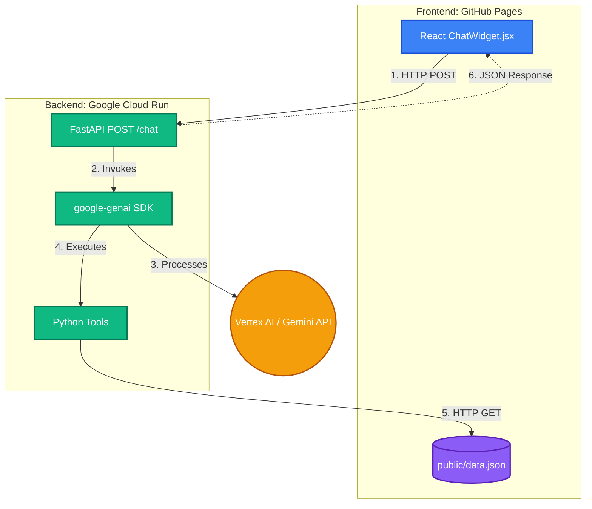
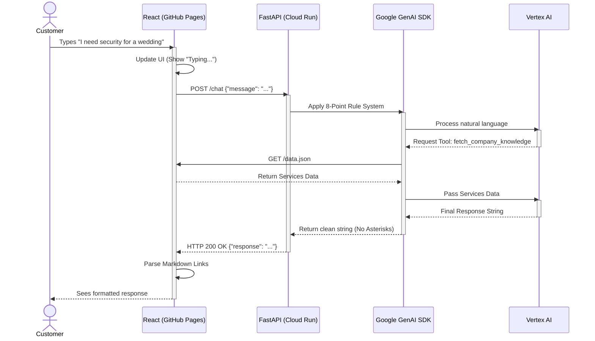

# Al-Marsoos AI Agent Architecture

This document outlines the high-level architecture, design choices, and system requirements for the Al-Marsoos Security AI Agent. 

## 1. Architectural Choice: Single Agent vs. Multi-Agent

During Phase 2, we evaluated a complex Multi-Agent architecture using Google ADK 2.0. However, for Phase 3 (Production), we explicitly pivoted to a **Single Agent Architecture** using the standard google-genai SDK and removed ADK 2.0 entirely.

**Rationale for the Pivot:**
1. **Streaming Bugs:** The ADK 2.0 multi-agent router natively returns an AsyncGenerator, which was incompatible with our synchronous FastAPI requirement and caused the React frontend to display raw memory addresses.
2. **Speed & Latency:** Multi-agent routing requires an LLM call just to decide which sub-agent to invoke, doubling response latency. A single agent replies instantly.
3. **Simplicity:** A single Gemini 2.5 Flash model equipped with a strict 8-point rule system and Python tools is more than capable of handling HR, Sales, and Trust inquiries simultaneously without needing separate personas.

## 2. Requirements

### Functional Requirements (FRs)
1. **Natural Language Processing:** The system must accurately understand and respond to user queries regarding security services.
2. **Dynamic Quoting:** The system must calculate event security requirements (guards needed) based on user-provided guest counts using a deterministic mathematical tool.
3. **Knowledge Retrieval:** The system must dynamically fetch live company data (leadership, services) from the frontend's data.json file.
4. **Rich UI Navigation:** The system must generate specific Markdown links (e.g., [Contact Us](/contact)) that the frontend parses into clickable buttons.

### Non-Functional Requirements (NFRs)
1. **Security (Authentication):** The backend must use Google Cloud Vertex AI (Application Default Credentials) in production, completely eliminating hardcoded API keys.
2. **Resilience (Graceful Degradation):** If the backend crashes or is blocked by CORS, the frontend must not break; it must seamlessly display a fallback WhatsApp link.
3. **Performance:** The backend API must respond to queries within 3 seconds.
4. **Maintainability:** The backend rules must be consolidated into a single readable string for easy future modification.

---

## 3. Structural Diagram (Component Architecture)

---

## 4. Interaction Flow (Sequence Diagram)

---

## 5. Security & Deployment

* **Local Development:** Uses standard genai.Client() with a .env file containing GEMINI_API_KEY.
* **Production Deployment:** Uses genai.Client(vertexai=True). Cloud Run utilizes its built-in IAM Service Account to securely access Vertex AI without needing an API key. 
* **Deployment Command:** gcloud run deploy al-marsoos-agent --source . --region us-central1
