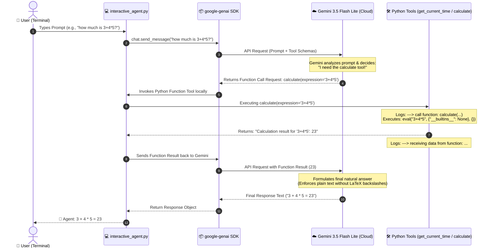
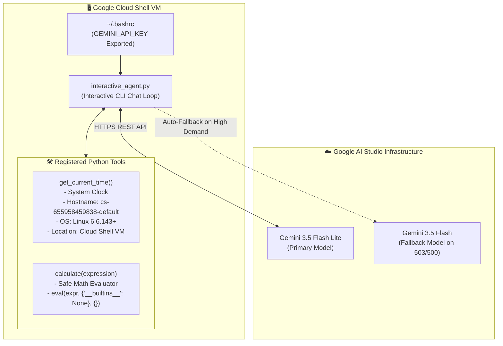

# Google Gemini AI Agent Architecture & Workflow Guide

This document explains the end-to-end architecture, tool execution (function calling) flow, security model, and error-handling mechanisms for the interactive Gemini AI Agent in [`interactive_agent.py`](file:///home/farooque_azam/ai-agent-demos/interactive_agent.py).

---

## 1. Executive Summary

The AI Agent combines the reasoning power of **Google's Gemini 3.5 Flash Lite** with the precise, deterministic execution of **Local Python Code**. 

* **The Problem:** Large Language Models (LLMs) cannot check real-time clocks or server locations, and often make mistakes when calculating complex math.
* **The Solution:** **Function Calling (Tools)**. Gemini acts as the "brain" that decides *when* a tool is needed, and your local Python VM acts as the "hands" that executes the exact code.

---

## 2. End-to-End Workflow Sequence Diagram



---

## 3. High-Level Component Architecture



---

## 4. Detailed Step-by-Step Breakdown

### Step 1: Authentication & Environment Setup
* The API Key is securely retrieved from the environment using `os.environ.get("GEMINI_API_KEY")`.
* Persistent loading is configured in [`~/.bashrc`](file:///home/farooque_azam/.bashrc) so it loads automatically across Cloud Shell sessions.

### Step 2: Tool Registration & Schema Generation
When `get_chat()` initializes:
```python
client.chats.create(
    model="gemini-3.5-flash-lite",
    config=types.GenerateContentConfig(
        tools=[get_current_time, calculate],
        system_instruction="..."
    )
)
```
1. The `google-genai` SDK inspects Python **type hints** (e.g. `expression: str`) and **docstrings**.
2. It converts function signatures into OpenAPI JSON schemas and sends them to Gemini so Gemini knows what tools exist and what arguments they accept.

### Step 3: Prompt Processing & Tool Selection
When a user asks a question:
* **General Questions** (e.g. *"What is the capital of Pakistan?"*): Gemini answers directly from its trained knowledge without triggering tools.
* **Real-time / Math Questions** (e.g. *"What time is it?"* or *"Calculate 3+4*5"*): Gemini detects that a tool is needed, extracts the required arguments, and requests function execution.

### Step 4: Local Execution & Security Guardrails
Your local Python VM executes the requested tool:
* **`get_current_time()`**: Reads the system clock, retrieves `socket.gethostname()`, and returns OS/location details.
* **`calculate(expression)`**: Evaluates math expressions securely using:
  ```python
  eval(expression, {"__builtins__": None}, {})
  ```
  > [!IMPORTANT]
  > Setting `"__builtins__": None` disables dangerous Python functions like `import`, `open()`, and `os.system()`, preventing code injection attacks.

### Step 5: Plain Text Formatting (No LaTeX Backslashes)
The `system_instruction` instructs Gemini:
> *"Do NOT use LaTeX math syntax or backslashes like `\(` or `\times`. Always write math in plain text."*

This guarantees clean rendering in command-line terminals.

### Step 6: High-Demand Fault Tolerance (Resilient Retry)
If Gemini experiences temporary server congestion (`503 UNAVAILABLE` or `500 INTERNAL`), the script automatically catches the exception and switches to a backup model (`gemini-3.5-flash`), keeping the user chat session alive seamlessly.

---

## 5. Running the Agents

These single-agent demos use the raw Python `google-genai` SDK and must be run as standard Python scripts from within your active virtual environment.

### Prerequisites

Ensure you are in the correct directory and your virtual environment is active:

```bash
# Navigate to the project directory
cd ~/ai-agent-demos/genai_sdk_demo

# Activate the virtual environment
source ../.venv/bin/activate
```

### Running the Basic Agent (`hello_agent.py`)

This script demonstrates a basic one-off execution of an agent that uses a custom tool (function calling).

```bash
python hello_agent.py
```

### Running the Interactive Agent (`interactive_agent.py`)

To test the interactive agent with full tool logging, error recovery, and a continuous chat loop:

```bash
python interactive_agent.py
```
